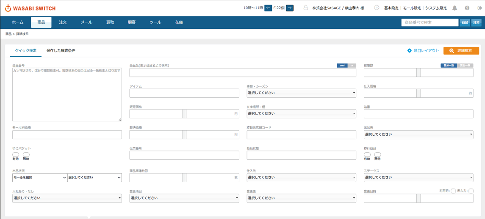

# 【ポートフォリオ】 衣類出品業務における入力・進捗管理効率化ツール (Chrome 拡張機能)
- - -
## 【解決した課題】
私はアルバイトでECサイトへの衣類出品業務（採寸・状態確認・Webアプリへの入力）を担当していました。  
その中で、以下のような非効率さを感じ、解決するためにChrome拡張機能を開発しました。
### 課題1: 入力作業の非効率性
+ 商品状態入力後、バーコードリーダーが全角で読み取るため、毎回半角に直す作業が必要。
+ 入力項目が多岐にわたり、マウス操作やTab移動に時間がかかる。

### 課題2: 進捗管理の不正確性
+ 出品数を手元カウンターで数え、1時間ごとに報告する方式。
+ カウントを忘れたり、持ち回りの作業で報告時間のずれが発生するため、正確な進捗管理が難しい状況。
- - -
## 【主な機能】
### 入力作業を改善する機能
1. フォーカス機能＆全角自動半角変換  
入力欄に自動でフォーカスし、バーコードリーダーからの全角入力を半角に変換したあと、エンターキーを自動で入力します。
2. Tab移動の最適化機能  
不要な入力項目を非表示（disabled）にし、tabindexを割り振りました。
3. 入力項目の自動選択機能  
部署で共通のラジオボタンを自動で選択状態にします。
4. 動的ページ対応  
アイテム選択後に表示される追加ページにもタブ移動がスムーズにできるようになります。

### 進捗管理を正確にする機能
5. リアルタイム自動カウンター  
登録ごとに商品コード・作業者・登録時間をlocalStorageに保存。現在の進捗数を表示します。
6. 履歴確認機能  
過去の記録を矢印ボタンで確認可能。日付の違うデータを保存すると過去のデータは自動リセットされ、どの時間でも正確な数値を表示します。
#### 商品番号を入力する画面

#### カウンターの画面

#### localStorageのデータ画面

#### 機能一覧の画面 

- - -
## 【他部署からの依頼対応】
ツールが自身の部署で活用される中、他部署からも「Tab移動を効率化してほしい」と依頼を受け、  
商材作成_moveTabを作製しました。
- - -
## 【学んだこと】
JavaScriptのDOM操作や、ユーザーの要望に応じて機能をカスタマイズする力を養いました。
経験が浅いため、より効率的で洗練されたコードを書く余地があることは自覚しています。
しかし、自分の技術が人の役に立ち、他部署の方にも喜んでいただけたことが嬉しかったです。
今後は、個人開発だけでなく、チーム開発を通じてより効率的で洗練されたコードを学びたいと考えています。
御社のチームの一員として、多くの人々に貢献できるサービスを作り上げていきたいです。
